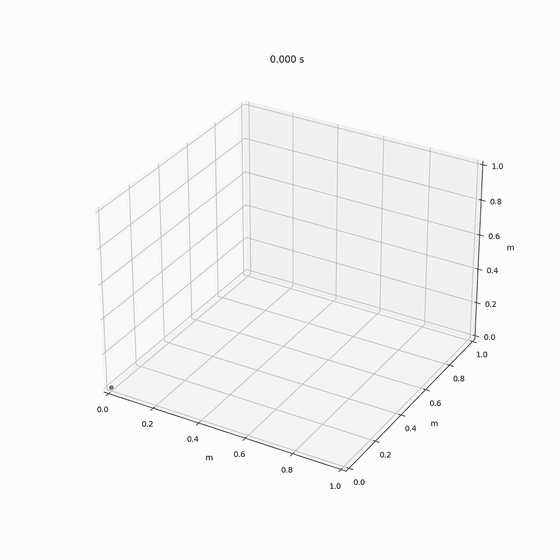

# Raspberry Pi 5 Vision Car

A four-week university **Engineering Week** group project: a small line-following and teleoperated car built around an **Arduino** (motor & sensor MCU) and a **Raspberry Pi 5** (control and live telemetry). This repository holds the firmware, the Raspberry Pi scripts, the circuit schematics and a Webots simulation — organised from the original, sprawling working folder.

> This is coursework. It contains both the final working code and the intermediate experiments that led to it (encoder tuning, sensor calibration, abandoned branches kept out). Treat it as a record of the build, not production code.

## Overview

| Layer | Role |
|---|---|
| Arduino (car MCU) | Motor & encoder control, line following, sensors, Bluetooth/RF comms |
| Raspberry Pi 5 (Python) | PS5-controller teleoperation, live position plotting, PID simulation |
| Schematics | Fritzing breadboard layouts + KiCad boards (RF module, MPU-6050) |
| Simulation | Webots e-puck line-following project + a Python sensor/PID model |

## Demo

The live 3D position of the car, plotted on the Raspberry Pi from the IMU telemetry (see [`raspberry-pi/vision`](raspberry-pi/vision)):



More clips in [`docs/media/`](docs/media):

| Clip | What it shows |
|---|---|
| [`car_demo.mp4`](docs/media/car_demo.mp4) | Full demo-session recording (3 min, 720p, 32 MB) |
| [`pid_sim_demo.mp4`](docs/media/pid_sim_demo.mp4) | The Python PID line-follower simulation running (38 MB) |
| [`mpu6050_yaw.mp4`](docs/media/mpu6050_yaw.mp4) | Slide walkthrough of the MPU-6050 yaw control loop (100 Hz) |

## What the car can do

- **Drive & measure** — DC motors with encoders, straight-line and turning control, speed measurement
- **Follow a line** — 8-channel IR line sensor (I2C address `0x09`) with PID steering
- **Sense** — MPU-6050 (acceleration → velocity → displacement), voltage, buzzer, EC11 rotary encoder, buttons, display
- **Communicate** — UART, HC-06 Bluetooth, 433 MHz RF (transmit/receive)
- **Teleoperate** — a PlayStation 5 controller drives the car over Bluetooth serial
- **Visualise** — the Pi plots the car's real-time XY position from IMU-integrated telemetry

## Repository layout

```
.
├── firmware/                 # Arduino sketches (car MCU)
│   ├── motors_encoders/      # motor, encoder, straight-line & speed control
│   ├── line_following/       # IR line sensor + PID
│   ├── sensors/              # MPU-6050, voltage, buzzer, EC11, screen
│   ├── communication/        # UART, HC-06 Bluetooth, RF 433 MHz
│   ├── ps5_controller/       # PS5 gamepad over Bluetooth
│   └── misc/                 # blink/fade and loose demos
├── raspberry-pi/
│   ├── control/              # PS5 -> Bluetooth serial, debug helpers
│   ├── vision/               # live XY-position plotting, sensor calibration
│   └── simulation/           # Python model of the line sensor + PID tuning
├── schematics/               # Fritzing (.fzz) + KiCad (RF, MPU-6050)
├── simulation/               # Webots e-puck line-following world & controllers
├── README.md
└── .gitignore
```

### Firmware highlights

| Sketch | What it does |
|---|---|
| `line_following/LineFollowTest.ino` | Reads the 8-channel IR sensor over I2C and prints the array |
| `line_following/topic2_code_PID.ino` | PID line-following control |
| `motors_encoders/update_motor_control.ino` | Motor + encoder closed-loop driving |
| `communication/Transmit/Transmit.ino` + `Receive/Receive.ino` | 433 MHz RF link |
| `communication/HC-06/HC-06.ino` | Bluetooth serial |
| `sensors/mpu_a-v-d_code/mpu_a-v-d_code.ino` | MPU-6050 acceleration → velocity → displacement |
| `ps5_controller/ps5_arduino.ino` | Receives PS5 commands over Bluetooth |

### Raspberry Pi highlights

| Script | What it does |
|---|---|
| `control/ps5_control.py` | Reads a PS5 gamepad (pygame) and sends `S/L/R/...` commands over HC-06 serial |
| `vision/3dposition.py` | Parses the car's JSON telemetry and plots its XY position live (matplotlib) |
| `simulation/simulation/sim.py` | Simulates the track + IR sensor readings and tunes PID gains (`best_params.json`) |

## Schematics

- **Fritzing** — breadboard wiring for LED, buzzer, rotary encoder and the Task 3.2 circuit (`.fzz`)
- **KiCad** — `RF` (433 MHz module) and `MPU-6050` boards (`.kicad_sch` / `.kicad_pcb`)

## Simulation

`simulation/` is a Webots project for the **e-puck** robot used to prototype line following before flashing the car. It contains the world (`worlds/e-puck_line_demo.wbt`) and the controller / remote-control / robot-window plugins as C++ source. Compiled binaries (`.dll`, `.exe`, `.o`) are not tracked — Webots rebuilds them from the `Makefile`s.

## Notes

- **Reports are intentionally not included** — the lab reports and logbook contain the authors' names and student IDs. They remain in the original local folder.
- Calibration data (`.csv`/`.txt`) and media (`.mp4` recordings, photos) are also kept out of the repo; only source and schematics are tracked.
- Some sketches are rough or leftover experiments (e.g. `firmware/motors_encoders/edition*.ino`); they are kept for reference.
- Comms parameters vary per sketch — Bluetooth uses `SoftwareSerial` at 9600 baud, RF uses 433 MHz modules; check each sketch's header.

## Built with

- [Arduino](https://www.arduino.cc/) — car MCU firmware
- [Raspberry Pi 5](https://www.raspberrypi.com/) — control & telemetry (Python 3, `pyserial`, `pygame`, `matplotlib`, `numpy`)
- [Webots](https://cyberbotics.com/) — e-puck robot simulation
- [Fritzing](https://fritzing.org/) / [KiCad](https://www.kicad.org/) — schematics
- [i2cdevlib MPU-6050](https://github.com/jrowberg/i2cdevlib) — IMU example code
